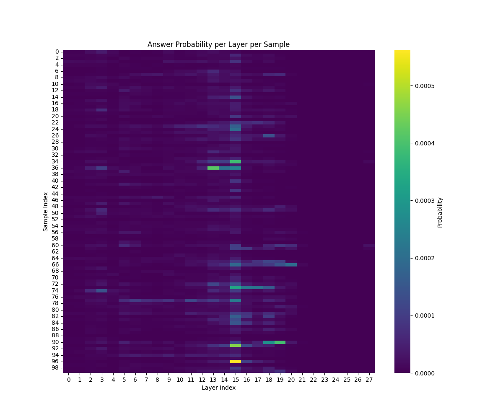

# Causal Tracing of "Answer-First" Bias in Math Reasoning

## 📌 Project Overview
This project investigates faithfulness in Chain-of-Thought (CoT) reasoning models. Specifically, we test the **"Answer-First" Hypothesis**:
> Does the model "decide" the final answer in its hidden states *before* it generates the reasoning steps?

If the answer (e.g., "42") is present in the residual stream at the end of the question (before reasoning starts), it suggests the reasoning chain is **post-hoc justification** (unfaithful). If the answer is absent, the reasoning is likely **necessary** (faithful).

## 🔬 Methodology: Logit Lens
We use the **Logit Lens** technique to "x-ray" the model.
1.  **Input**: A math problem from GSM8K (e.g., "If John has 2 apples...").
2.  **Probe Point**: The final token of the question input (Layer 0 to Layer L).
3.  **Decoding**: At each layer, we project the hidden state $h_i$ to the vocabulary using the unwrapping matrix $W_U$:
    $$P(token) = \text{softmax}(LayerNorm(h_i) \cdot W_U^T)$$
4.  **Metric**: The probability assigned to the *ground truth answer* token.

## 📊 Phase 1 Results: Pre-Reasoning Check
**Model**: `Qwen/Qwen2.5-Math-1.5B-Instruct`
**Dataset**: GSM8K (Test Split, n=50 single-token answer samples)

### Key Finding: **0.00% Early Emergence**
The model does **not** know the answer before reasoning begins. Across 50 samples, the probability of the correct answer at the final layer of the prompt was negligible (~0.00%).

### Visual Evidence

#### 1. Average Probability Across Layers
The probability remains near zero across all layers. There is no "spike" indicating a pre-computed answer.


#### 2. Sample-wise Heatmap
Consistent darkness across all samples confirms no outliers where the model "guessed" early.


## 🚀 Usage

### 1. Installation
```bash
pip install -r requirements.txt
```

### 2. Configuration
Edit `config.yaml` to change parameters:
```yaml
model:
  name: "Qwen/Qwen2.5-Math-1.5B-Instruct"
dataset:
  num_samples: 50
```

### 3. Run Experiment
```bash
python -m src.run_experiment
```

### 4. Visualize Results
```bash
python src/visualize.py
```

## 📁 Structure
- `src/`: Core logic (LogitLens, DataLoader, Analysis).
- `notebooks/`: Exploratory notebooks.
- `results/`: output JSON data and generated plots.
- `config.yaml`: Central experiment configuration.

## 🔜 Phase 2: Middle-of-Reasoning Trace
The next phase will apply Logit Lens *during* the generation of the CoT to pinpoint the exact moment (layer & token position) the answer emerges.
