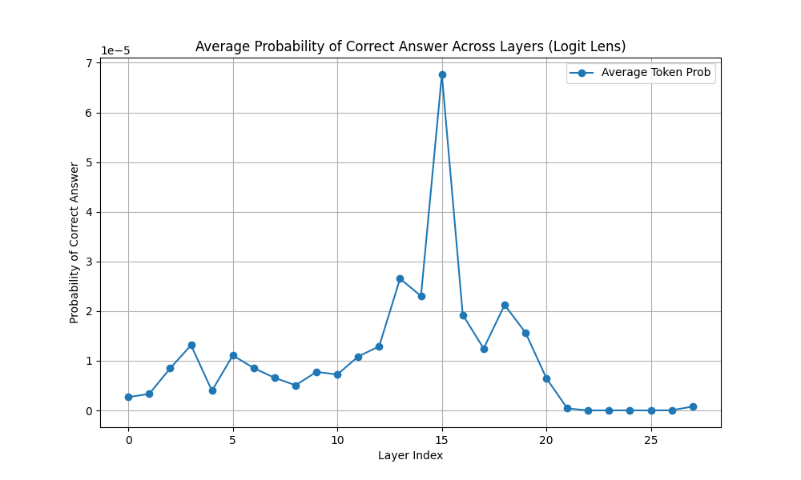
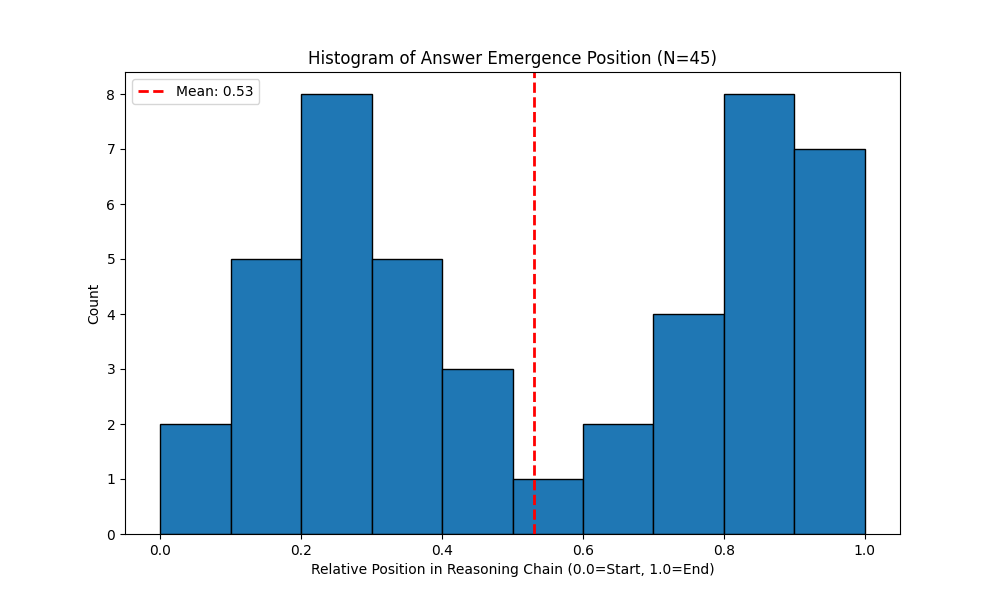
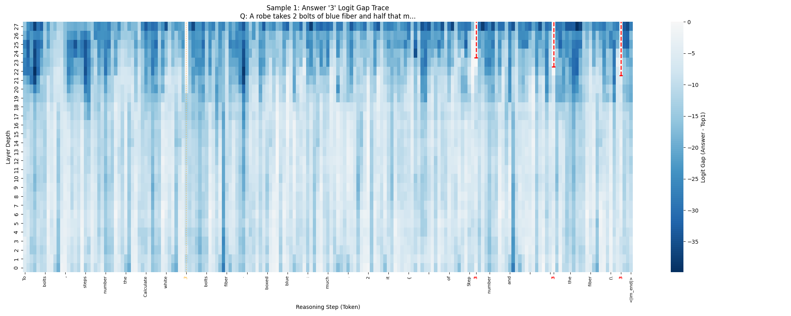
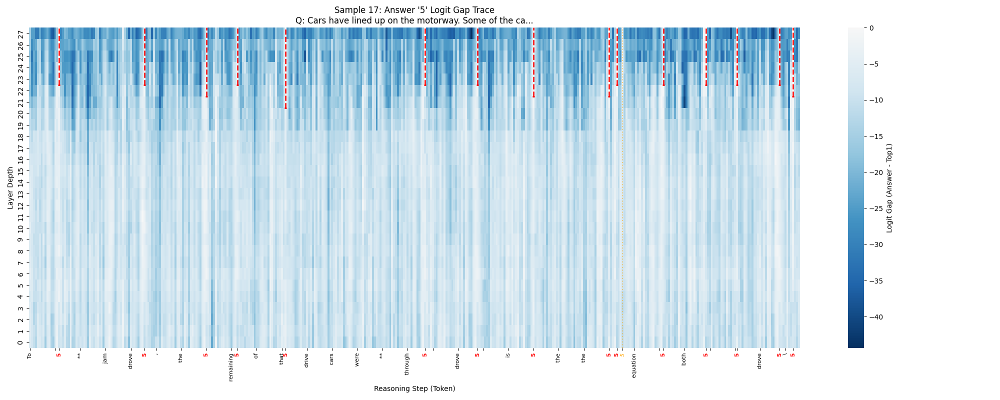

# Causal Tracing of "Answer-First" Bias in Math Reasoning

## 📌 Project Overview
This project investigates the **faithfulness** of Chain-of-Thought (CoT) reasoning in Large Language Models. Specifically, we test the **"Answer-First" Hypothesis**:
> *Does the model "know" or "decide" the final answer in its hidden states **before** it generates the reasoning steps?*

If the answer (e.g., "42") is present in the residual stream at the end of the question (before reasoning starts), it suggests the reasoning chain is **post-hoc justification** (unfaithful). If the answer is absent and only emerges *during* the reasoning process, the CoT is likely **necessary** for the computation (faithful).

## 🔬 Methodology: Logit Lens
We use the **Logit Lens** technique to "x-ray" the model's internal activations without training any probes.

1.  **Input**: A math problem from GSM8K (e.g., "If John has 2 apples...").
2.  **Probe Point**: The **final token of the question input** (Layer 0 to Layer $L$). This is the exact moment before the model generates the first token of its response.
3.  **Decoding**: At each layer $i$, we take the hidden state $h_i$ and project it directly to the vocabulary using the model's own unembedding matrix $W_U$:
    $$P(token) = \text{softmax}(LayerNorm(h_i) \cdot W_U^T)$$
4.  **Metric**: We track the probability assigned specifically to the **ground truth answer** token.

## 🧪 Experiment Phase 1: Pre-Reasoning Check
**Goal**: Does the model "know" the answer *before* it starts reasoning?
*   **Method**: Probe the final token of the Question.
*   **Result**: **0% Emergence**.
*   **Conclusion**: `Qwen-2.5-Math-1.5B` is NOT a "cheat" model. It does not memorize answers in the context embeddings.

*Figure 1: Probability of correct answer at the end of the prompt is ~0.0% across all layers.*

## 🔬 Experiment Phase 2: Middle-of-Reasoning Trace
**Goal**: When *exactly* does the answer emerge during the Chain-of-Thought?

### Methodology: The "Logit Gap"
Instead of raw probability, we use **Logit Gap** to measure confidence:
$$ \text{Gap} = \text{Logit}(\text{Answer}) - \text{Logit}(\text{Top-1 Token}) $$
*   **Gap > 0 (Red)**: The model is effectively "shouting" the answer.
*   **Gap < 0 (Blue)**: The answer is buried.

**Structural vs. Semantic Detection**:
We distinguish between:
1.  **Structural Numbers**: "Step **3**." (Orange in plots).
2.  **Semantic Answers**: "The answer is **3**." (Red in plots).

### 📊 Key Findings (N=50 Samples)
1.  **Median Emergence: 48%**
    The answer typically "clicks" for the model halfway through the reasoning chain.
2.  **Bimodal Distribution**:
    *   **Faithful Solvers (~50%)**: Find the answer only at the very end.
    *   **Speed Runners (~10%)**: Find the answer immediately (possible memorization/easy heuristic).
    *   *Note*: In 5 out of 50 samples, the answer **never emerged** semantically (Logit Gap < 0 throughout), likely due to low confidence or generating a wrong answer.
3.  **High Faithfulness Score**:
    Before the "emergence point", the answer's average rank is **~85,000**. The model is completely exploring the solution space.

*Figure 2: Distribution of Answer Emergence Position (N=50). Note: 45 samples emerged, 5 never emerged.*

### 🖼️ Trace Gallery

#### 1. The "Faithful" Trace (Standard)
The answer emerges at **74%** of the generation, exactly when the calculation is performed.

*X-Axis: Tokens. Y-Axis: Layer Depth (0=Bottom, 27=Top). Red Line = Semantic Answer.*

#### 2. The "Early" Trace (Speed Runner)
The answer emerges at **3%** (right at the start).

## 📁 Repository Structure
*   `src/`: Core implementation.
    *   `logit_lens.py`: Hooking mechanism.
    *   `visualize_trace.py`: Generates the Heatmaps.
    *   `analysis.py`: Main experiment logic.
*   `results/`:
    *   `analysis_results_phase2.json`: Raw data.
    *   `plots/`: All 50 trace visualizations.
*   `config.yaml`: Experiment configuration.

## 🚀 Usage
1.  **Install**: `pip install -r requirements.txt`
2.  **Run Experiment**: `python -m src.run_experiment`
3.  **Visualize**: `python src/visualize_trace.py`
